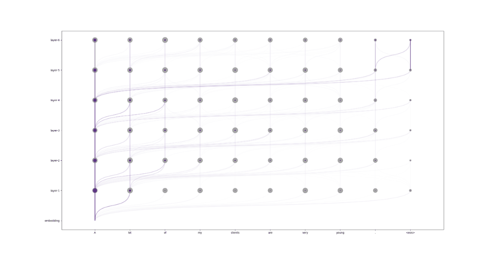

<p align="center">
  
</p>

<p align="center">
  <br />
  <br />
  <a href="https://pypi.org/project/pydec/"></a>
  <a href="https://github.com/DoubleVII/pydec/actions/workflows/python-package-conda.yml"></a>
  <a href="https://doublevii.github.io/pydec/"></a>
  <a href="https://codecov.io/gh/DoubleVII/pydec"></a>
  <a href="https://opensource.org/licenses/MIT"></a>
</p>

--------------------------------------------------------------------------------

PyDec is a linear decomposition toolkit for neural network based on [PyTorch](https://pytorch.org/), which can decompose the tensor in the forward process into given components with a small amount of code. The result of decomposition can be applied to tasks such as attribution analysis.

### Features:
* Fast. Compute decomposition in foward process and benefit from GPU acceleration.
* Run once, decompose anywhere. Obtain the decomposition of all hidden states (if you saved them) in forward propagation.
* Applicable to networks such as Transformer, CNN and RNN.

# Examples
<!-- ## Attribution
Contribution Heat maps of the Roberta model (fine-tuned on SST-2). Warm colors indicate high
contribution while cool colors indicate low contribution. The outputs of the model were positive, negative and positive, but the latter two samples did not match the labels.

<div align="center">

</div> -->

## Data flow visualization



# Requirements and Installation
* [PyTorch](https://pytorch.org/) version >= 1.11.0
* Python version >= 3.7
* To install PyDec and develop locally:

``` bash
git clone https://github.com/DoubleVII/pydec
cd pydec
pip install --editable ./
```

* To install the latest stable release:
``` bash
pip install pydec
```

# Getting Started

## Example: deompose a tiny network

As a simple example, here's a very simple model with two linear layers and an activation function. We'll create an instance of it and get the decomposition of the output:
```python
import torch

class TinyModel(torch.nn.Module):
    def __init__(self):
        super(TinyModel, self).__init__()

        self.linear1 = torch.nn.Linear(4, 10)
        self.activation = torch.nn.ReLU()
        self.linear2 = torch.nn.Linear(10, 2)

    def forward(self, x):
        x = self.linear1(x)
        x = self.activation(x)
        x = self.linear2(x)
        return x

tinymodel = TinyModel()
```

Given an input `x`, the output of the model is:
```python
x = torch.rand(4)

print("Input tensor:")
print(x)

print("\n\nOutput tensor:")
print(tinymodel(x))
```
Out:
```
Input tensor:
tensor([0.7023, 0.3492, 0.7771, 0.0157])


Output tensor:
tensor([0.2751, 0.3626], grad_fn=<AddBackward0>)
```
To decompose the output, just input the Composition initialized from `x`:
```python
c = pydec.zeros(x.size(), c_num=x.size(0))
c = pydec.diagonal_init(c, src=x, dim=0)

print("Input composition:")
print(c)

c_out = tinymodel(c)

print("\n\nOutput composition:")
print(c_out)
```
Out:
```
Input composition:
composition{
  components:
    tensor([0.7023, 0.0000, 0.0000, 0.0000]),
    tensor([0.0000, 0.3492, 0.0000, 0.0000]),
    tensor([0.0000, 0.0000, 0.7771, 0.0000]),
    tensor([0.0000, 0.0000, 0.0000, 0.0157]),
  residual:
    tensor([0., 0., 0., 0.])}


Output composition:
composition{
  components:
    tensor([-0.0418, -0.0296]),
    tensor([0.0566, 0.0332]),
    tensor([0.1093, 0.1147]),
    tensor([ 0.0015, -0.0018]),
  residual:
    tensor([0.1497, 0.2461]),
  grad_fn=<AddBackward0>}
```

Each component of the output composition represents the contribution of each feature in `x` to the output.
Summing each component yields the tensor of original output:
```python
print("Sum of each component:")
print(c_out.c_sum())
```
Out:
```
Sum of each component:
tensor([0.2751, 0.3626], grad_fn=<AddBackward0>)
```

# Documentation

The [full documentation](https://doublevii.github.io/pydec/) contains examples of implementations on real-world models, tutorials, notes and Python API descriptions.


# Linear Decomposition Theory
To understand the principles and theories behind PyDec, see our paper [Local Interpretation of Transformer Based on Linear Decomposition](https://aclanthology.org/2023.acl-long.572/).